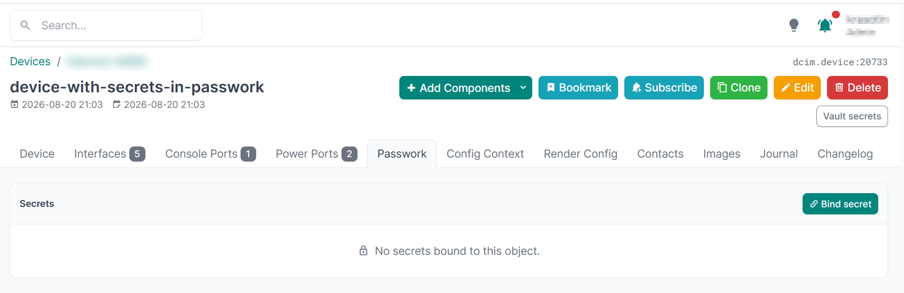
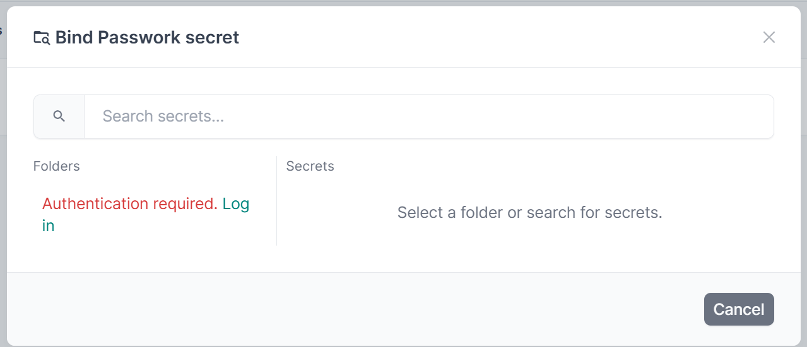
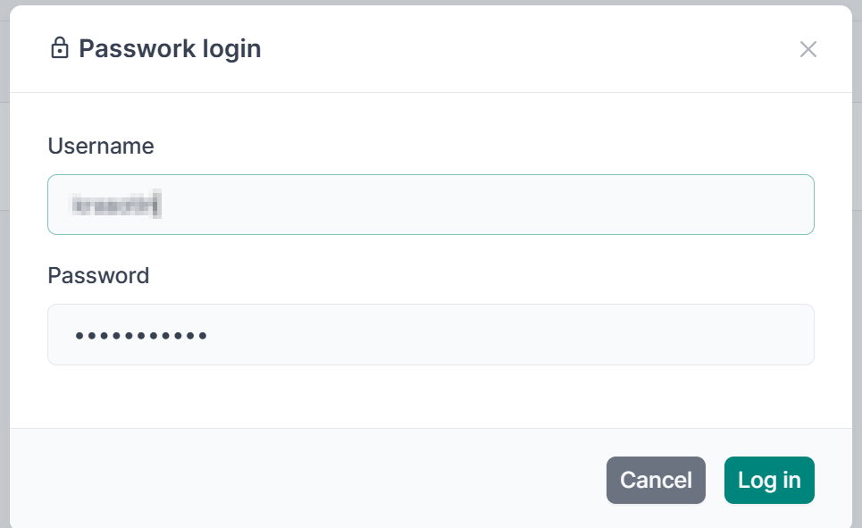
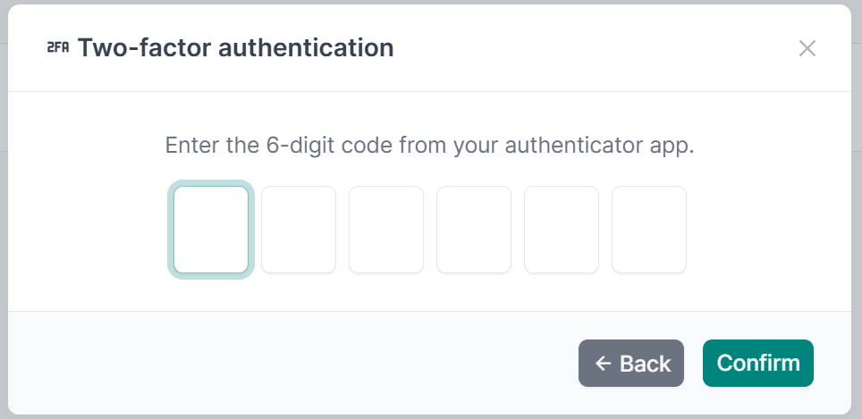
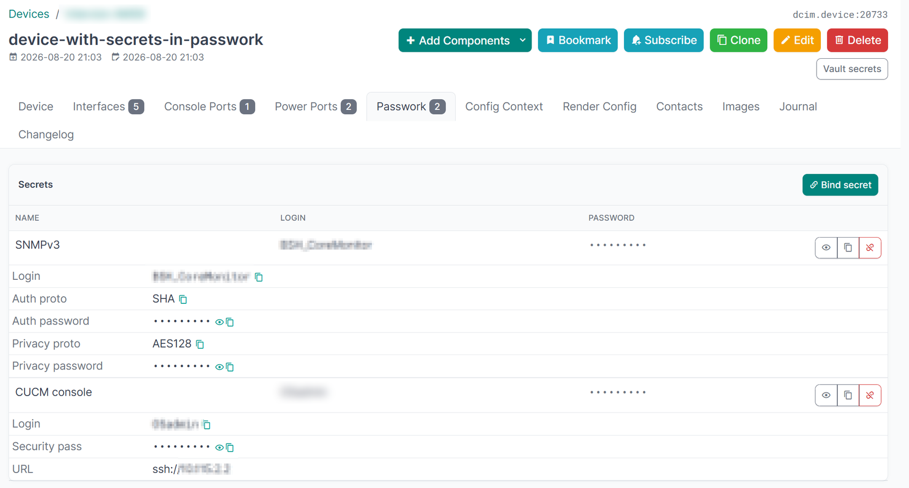

# netbox-passwork

[](https://github.com/krasotinpa/netbox-passwork-plugin/actions/workflows/ci.yml)
[](LICENSE)

NetBox plugin for Passwork secrets manager integration.

Adds a **Passwork** tab to Device, Virtual Machine, and Service pages,
allowing users to view, reveal, and copy secrets from Passwork without leaving NetBox.

---

## Requirements

| Component   | Version       |
|-------------|---------------|
| NetBox      | 4.5+          |
| Python      | 3.12+         |
| PostgreSQL  | 14+           |
| Passwork    | 7.6+ (CSE off)|

### Compatibility

| Plugin  | NetBox    | Python      | Tested in CI                           |
|---------|-----------|-------------|----------------------------------------|
| 1.3.x   | 4.5 – 4.6 | 3.12 – 3.14 | NetBox 4.5.10 and 4.6.8 on 3.12 / 3.14 |
| 1.0–1.2 | 4.5       | 3.11+       | not covered by CI                      |

Every pull request runs the full test suite against the NetBox versions in the table above — see
[.github/workflows/ci.yml](.github/workflows/ci.yml). Python 3.12 is the floor because NetBox 4.5
requires it.

### Dependencies

Django, NetBox and their dependencies come from the NetBox installation the plugin runs inside. On
top of those, the plugin pulls in:

| Package               | Version  | Used for                                         |
|-----------------------|----------|--------------------------------------------------|
| `requests`            | `>=2.31` | the Passwork API client                          |
| `cryptography`        | `>=41.0` | Fernet encryption of the Passwork session tokens |
| `djangorestframework` | `>=3.14` | serializers for the NetBox changelog integration |

---

## Installation

```bash
pip install netbox-passwork
```

Add to `configuration.py`:

```python
PLUGINS = ['netbox_passwork']

import os
PLUGINS_CONFIG = {
    'netbox_passwork': {
        'PASSWORK_URL':             'https://passwork.internal',
        'PASSWORK_VERIFY_SSL':      True,
        'SESSION_ENCRYPT_KEY':      os.environ['PW_SESSION_KEY'],
        'TOKEN_REFRESH_MARGIN':     60,
        'PASSWORK_REQUEST_TIMEOUT': 5,
        'SECRET_REVEAL_TIMEOUT':    30,
    }
}
```

Apply migrations and collect static:

```bash
python manage.py migrate netbox_passwork
python manage.py collectstatic
```

---

## Configuration

| Parameter                | Required | Default | Description                                      |
|--------------------------|----------|---------|--------------------------------------------------|
| `PASSWORK_URL`           | ✅       | —       | Passwork server URL                              |
| `SESSION_ENCRYPT_KEY`    | ✅       | —       | Fernet key for token encryption (env variable)   |
| `PASSWORK_VERIFY_SSL`    |          | `True`  | Verify SSL certificate                           |
| `TOKEN_REFRESH_MARGIN`   |          | `60`    | Seconds before access token expiry to refresh    |
| `PASSWORK_REQUEST_TIMEOUT`|         | `5`     | Passwork API request timeout (seconds)           |
| `SECRET_REVEAL_TIMEOUT`  |          | `30`    | Seconds before auto-hiding revealed secret       |

### Generating SESSION_ENCRYPT_KEY

```bash
python -c "from cryptography.fernet import Fernet; print(Fernet.generate_key().decode())"
```

Store in environment variable — **never** in `configuration.py`:

```bash
export PW_SESSION_KEY=<generated_key>
```

For systemd, add to service environment file:

```ini
# /etc/netbox/netbox.env
PW_SESSION_KEY=<generated_key>
```

---

## Permissions (RBAC)

Permissions are managed via NetBox **Admin → Users → Permissions**.
All permissions apply to the `PassworkBinding` model (`netbox_passwork` app).

| Permission        | Description                                    |
|-------------------|------------------------------------------------|
| `view_secrets`    | View the Passwork tab and secret list          |
| `reveal_secret`   | Reveal and copy secret values                  |
| `add_binding`     | Bind Passwork secrets to NetBox objects        |
| `delete_binding`  | Remove secret bindings                         |
| `view_auditlog`   | View audit log                                 |

### Assigning permissions via script

```python
from users.models import ObjectPermission
from django.contrib.contenttypes.models import ContentType
from netbox_passwork.models import PassworkBinding

ct = ContentType.objects.get_for_model(PassworkBinding)

for action, name in [
    ('view_secrets',   'Passwork: view secrets'),
    ('reveal_secret',  'Passwork: reveal secret'),
    ('add_binding',    'Passwork: add binding'),
    ('delete_binding', 'Passwork: delete binding'),
    ('view_auditlog',  'Passwork: view auditlog'),
]:
    perm, _ = ObjectPermission.objects.get_or_create(
        name=name, defaults={'actions': [action], 'constraints': None}
    )
    perm.object_types.add(ct)
    perm.users.add(user)  # assign to user
```

---

## Screenshots

The **Passwork** tab on a device: bound secrets live here, and there is nothing to see until a
secret is bound.



Binding a secret opens the picker. Passwork is authenticated separately from NetBox, so the first
action asks for a login.



The login runs against Passwork; the credentials never touch NetBox's own user database.



If the Passwork account has two-factor authentication enabled, the plugin asks for the code.



Once bound, the secrets of an object are listed with their fields. Passwords stay masked until the
user with the `reveal_secret` permission reveals or copies them — and both actions are recorded in
the audit log.



---

## Features

- **Passwork tab** on Device, VM, and Service pages
- **Lazy loading** — tab opens instantly, metadata loads in background
- **Login modal** with TOTP (2FA) support
- **Reveal / Hide** password with auto-hide timer
- **Copy to clipboard** (HTTP fallback for non-HTTPS)
- **Bind secret** via Passwork folder/search picker
- **Change logging** — binding create/delete events are recorded in the standard
  NetBox changelog (Operations → Change Log). Note: changelog entries are subject
  to the NetBox `CHANGELOG_RETENTION` setting (90 days by default) and do not
  record client IP addresses
- **Audit log** — every reveal/copy is recorded

---

## Security

- Passwork tokens stored **server-side** in Django session (never in browser)
- Tokens encrypted with Fernet before storing in session DB
- Passwords **never logged** or cached server-side
- Proxy endpoint validates `(object_type, object_id, pw_id)` binding before proxying
- Each user authenticates to Passwork with their own credentials

---

## Update

Use the bundled [update.sh](update.sh) — it activates the NetBox venv, upgrades
the plugin (from PyPI, or from the git repository when a tag is given), loads `PW_SESSION_KEY` from
`/etc/netbox/netbox.env` (required by the plugin at app load, so `migrate` fails
without it), runs migrations and `collectstatic`:

```bash
sudo ./update.sh            # latest release from PyPI
sudo ./update.sh v1.1.2     # pin a specific tag from the git repository
sudo systemctl restart netbox netbox-rq
```

Releases are tagged `vX.Y.Z` (SemVer) and published on the
[GitHub Releases](https://github.com/krasotinpa/netbox-passwork-plugin/releases)
page with notes from [CHANGELOG.md](CHANGELOG.md) and built sdist/wheel. Pin a
release tag on servers rather than tracking `main`.

Equivalent manual steps:

```bash
cd /opt/netbox
source venv/bin/activate
pip install --upgrade netbox-passwork
export PW_SESSION_KEY=$(grep -E '^PW_SESSION_KEY=' /etc/netbox/netbox.env | cut -d= -f2-)
python netbox/manage.py migrate netbox_passwork
python netbox/manage.py collectstatic --no-input
sudo systemctl restart netbox netbox-rq
```

## Rollback

```bash
python manage.py migrate netbox_passwork <previous_migration>
pip install --force-reinstall "netbox-passwork==<previous_version>"
```

> **Warning:** migration `0003` is destructive — it drops the
> `PassworkBindingHistory` table and permanently deletes soft-deleted bindings.
> Rolling back below `0003` requires restoring from a database backup taken
> before the upgrade.

---

## Development

```bash
git clone https://github.com/krasotinpa/netbox-passwork-plugin.git
cd netbox-passwork-plugin
pip install -e ".[dev]"
export PW_SESSION_KEY=$(python -c "from cryptography.fernet import Fernet; print(Fernet.generate_key().decode())")
pytest
```

One entry point for all checks (sets up the NetBox environment from `.env`,
see `.env.example` and `docs/development.md`):

```bash
scripts/test.sh            # Python tests (any pytest args accepted)
scripts/test.sh lint       # ruff
scripts/test.sh js         # JS tests (node --test + jsdom)
scripts/test.sh all        # everything + markdown summary for the PR
```

Pre-commit hooks:

```bash
pre-commit install
pre-commit run --all-files
```

## Support

- **Questions and bug reports** — open an [issue](https://github.com/krasotinpa/netbox-passwork-plugin/issues).
  The bug report form asks for the plugin, NetBox and Passwork versions, which is usually what a
  diagnosis needs; please redact secrets from any logs you attach.
- **Security issues** — do not open a public issue. Report them privately to the maintainer at
  krasotinpa@gmail.com. [docs/security.md](docs/security.md) documents the security model and the
  known limitations.
- **Feature requests** — use the feature request form and describe the workflow you are trying to
  support, not only the change you have in mind.

This is a single-maintainer project: expect a reply within a few working days rather than within
hours, and no guaranteed response times.

## Contributing

Bug reports, feature requests and pull requests are welcome — see
[CONTRIBUTING.md](CONTRIBUTING.md) for the branch and pull-request rules, and
[docs/index.md](docs/index.md) for the developer documentation.

## License

Licensed under the [Apache License 2.0](LICENSE).

The plugin icon ([docs/img/icon.svg](docs/img/icon.svg)) is an original work by the maintainer,
licensed under [CC BY 4.0](https://creativecommons.org/licenses/by/4.0/).
